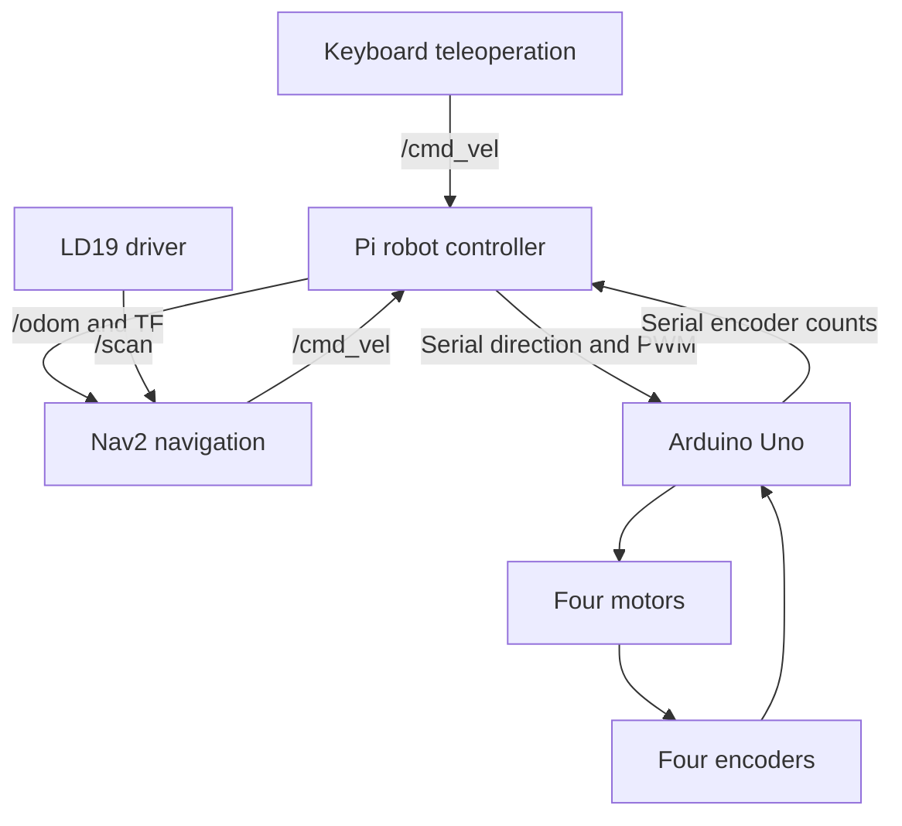

# Raspberry Pi 5 ROS 2 Differential-Drive Robot
(Readme is made using ChatGPT)
A custom four-wheel mobile robot using **ROS 2 Jazzy**, a **Raspberry Pi 5**, an **Arduino Uno**, and an **LD19 LiDAR**. The project includes motor speed control, encoder-based odometry, a robot description, launch files, and configuration for SLAM and Nav2 navigation.

**Author:** [Syed Razwanul Haque (Nabil)](https://github.com/Nabilphysics)

This repository preserves an experimental robot project. The hardware interfaces and configuration should be checked before running it on a robot. The Gazebo files are older experiments and are not a complete simulation of the current four-wheel robot.

## Hardware and software

| Component | Role |
|---|---|
| Raspberry Pi 5 | Runs ROS 2, wheel PID controllers, odometry, and navigation software |
| Arduino Uno | Reads four analog encoder inputs and applies motor commands |
| Four DC motors | Two motors on each side of the robot |
| L298N motor drivers | Motor direction and PWM control |
| Analog magnetic encoders | Wheel movement feedback |
| LD19 LiDAR | Publishes laser scans for mapping and obstacle detection |
| Ubuntu 24.04 / ROS 2 Jazzy | Target software environment documented in the project |

The two left wheels share a target speed, and the two right wheels share another. Each motor has a separate PID controller. Turning with four fixed wheels involves skid steering; the software uses a differential-drive kinematic model.

## System architecture



The Arduino uses a custom USB serial protocol, rather than micro-ROS. Motor PID control runs in Python on the Pi.

## Project layout

Paths below are relative to the project directory containing `ros2_nabil` and `ldlidar_ros2_ws`. Depending on how the files were uploaded, this directory may be the repository root or a nested `ROS 2 from RPI 5` directory.

| Path | Contents |
|---|---|
| `ros2_nabil/src/my_robot_controller/` | Python motor controller, PID and encoder helpers, Arduino firmware |
| `ros2_nabil/src/my_robot_description/` | URDF/Xacro robot model and model-viewing launch files |
| `ros2_nabil/src/my_robot_bringup/` | Robot startup launch files and RViz configurations |
| `ldlidar_ros2_ws/src/ldlidar_stl_ros2/` | LD19 driver, vendor SDK, and LiDAR launch files |
| `nav2_config/nav2_params.yaml` | Customized Nav2 parameters |
| `nav2_config/defaults.yaml` | Additional parameter snapshot/reference |
| `maps/my_map.yaml` and `maps/my_map.pgm` | Saved occupancy map |
| `ros_robot_command.txt` | Original ROS build and startup notes |
| `raspberry_pi_5_command.txt` | Pi power and performance notes |

`src/` contains editable source. `build/`, `install/`, and `log/` are generated workspace outputs. Rebuild the source on the target machine rather than relying on copied build outputs.

## Installation and build

Install ROS 2 Jazzy first using the [official Ubuntu installation instructions](https://docs.ros.org/en/jazzy/Installation/Ubuntu-Install-Debs.html).

Clone the repository:

```bash
git clone https://github.com/Nabilphysics/rosrpi5nav2.git
cd rosrpi5nav2
```

If the project folders are nested, enter their parent directory before continuing. Set a reusable absolute path from that directory:

```bash
export ROBOT_PROJECT_DIR="$PWD"
```

Install the main dependencies:

```bash
sudo apt update
sudo apt install \
  python3-colcon-common-extensions python3-rosdep python3-serial \
  ros-jazzy-rclpy ros-jazzy-rclcpp \
  ros-jazzy-geometry-msgs ros-jazzy-nav-msgs ros-jazzy-sensor-msgs \
  ros-jazzy-std-msgs ros-jazzy-tf2-ros ros-jazzy-tf2-tools \
  ros-jazzy-robot-state-publisher ros-jazzy-joint-state-publisher-gui \
  ros-jazzy-xacro ros-jazzy-rviz2 ros-jazzy-teleop-twist-keyboard \
  ros-jazzy-slam-toolbox ros-jazzy-navigation2 ros-jazzy-nav2-bringup
```

The package manifests do not yet declare every runtime dependency. The explicit list above covers the main robot, visualization, mapping, and navigation components; it does not set up the older Gazebo experiment.

Build the LiDAR workspace, then the robot workspace:

```bash
source /opt/ros/jazzy/setup.bash

cd "$ROBOT_PROJECT_DIR/ldlidar_ros2_ws"
colcon build --symlink-install
source install/setup.bash

cd "$ROBOT_PROJECT_DIR/ros2_nabil"
colcon build --symlink-install
source install/setup.bash
```

In each new terminal, set `ROBOT_PROJECT_DIR` to the absolute project directory and load:

```bash
source /opt/ros/jazzy/setup.bash
source "$ROBOT_PROJECT_DIR/ldlidar_ros2_ws/install/setup.bash"
source "$ROBOT_PROJECT_DIR/ros2_nabil/install/setup.bash"
```

## Arduino firmware and serial connections

Open and upload the Arduino sketch with its accompanying `.h` and `.cpp` files:

```text
ros2_nabil/src/my_robot_controller/my_robot_controller/
  microcontroller_code/arduinoCode/ros_robot_arduino/ros_robot_arduino.ino
```

The executable firmware constructors define these motor connections:

| Motor | IN1 | IN2 | PWM | Encoder |
|---|---|---|---|---|
| Right front | 2 | 4 | 3 | A0 |
| Left front | 8 | 7 | 5 | A1 |
| Right rear | 13 | 12 | 6 | A2 |
| Left rear | A5 | A4 | 10 | A3 |

Some header comments differ from the executable code. Verify motor and encoder directions against the actual wiring.

| Device | Configured port | Baud rate | Configuration file |
|---|---|---|---|
| Arduino | `/dev/ttyACM0` | 115200 | `diff_drive_robot.py` |
| LD19 | `/dev/ttyUSB0` | 230400 | `ld19.launch.py` |

Check device names and enable serial access:

```bash
ls -l /dev/serial/by-id/
sudo usermod -aG dialout "$USER"
```

Log out and back in after changing group membership. Update the configured ports if necessary; persistent `/dev/serial/by-id/` paths are useful when multiple USB devices are connected.

## Before moving the robot

- Add a command freshness timeout to the Pi controller. Currently it retains the last `/cmd_vel` command while continuing to communicate with the Arduino. The Arduino's communication timeout does not stop a stale ROS command while serial packets continue arriving.
- Resolve the duplicate `base_link → base_scan` transform. The URDF specifies a height of `0.03 m`, while `ld19.launch.py` publishes `0.18 m`. Use one publisher and the measured mounting position.
- Verify wheel calibration and track width. The controller uses `0.16 m` track width, while the URDF wheel-center separation is `0.21 m`.
- Match Nav2 velocity message types to the controller. The controller accepts `geometry_msgs/msg/Twist`; `nav2_params.yaml` currently enables `TwistStamped` on several Nav2 nodes. To retain the current controller interface, set the applicable `enable_stamped_cmd_vel` entries to `false` before using that configuration.

For initial direction and stop checks, support the robot with its wheels clear of the floor and keep motor power accessible.

## Run the robot

Run each long-lived command in its own sourced terminal.

### Robot and LiDAR, without RViz

```bash
ros2 launch my_robot_bringup slam_nabil_robot_noscreen.launch.xml
```

This starts the robot state publisher, motor controller, and LD19 driver. Despite its name, it **does not start SLAM Toolbox**.

To include RViz:

```bash
ros2 launch my_robot_bringup slam_nabil_robot.launch.xml
```

Alternatively, start the robot and LiDAR separately:

```bash
ros2 launch my_robot_bringup diff_nabil_robot.launch.xml
```

```bash
ros2 launch ldlidar_stl_ros2 ld19.launch.py
```

Choose one startup approach. Do not launch the same controller or LiDAR driver twice.

### Keyboard control

```bash
ros2 run teleop_twist_keyboard teleop_twist_keyboard
```

Keep the keyboard terminal focused and follow its displayed controls. Verify stopping before driving on the floor. Use one velocity command source at a time.

### Mapping

With robot odometry and LiDAR running:

```bash
ros2 launch slam_toolbox online_async_launch.py
```

Open RViz if it is not already running:

```bash
ros2 run rviz2 rviz2
```

Use `map` as the fixed frame and display `/map`, `/scan`, TF, and the robot model. Drive slowly using keyboard control.

Save a new map under a separate name:

```bash
ros2 run nav2_map_server map_saver_cli \
  -f "$ROBOT_PROJECT_DIR/maps/new_map"
```

### Navigation with a saved map

After resolving the configuration issues above, stop the mapping process and keyboard teleoperation. Keep robot bringup running, then launch the map server, AMCL localization, and navigation:

```bash
ros2 launch nav2_bringup bringup_launch.py \
  use_sim_time:=false \
  map:="$ROBOT_PROJECT_DIR/maps/my_map.yaml" \
  params_file:="$ROBOT_PROJECT_DIR/nav2_config/nav2_params.yaml" \
  autostart:=true
```

In RViz, set the initial pose with **2D Pose Estimate**, check alignment between scans and the map, then send a navigation goal using the available Nav2 goal tool.

The original notes also contain:

```bash
ros2 launch nav2_bringup navigation_launch.py
```

That command starts navigation components; saved-map navigation also needs a map server and localization. It does not explicitly load this repository's custom parameter file.

## Topics and transforms

| Interface | Type | Purpose |
|---|---|---|
| `/cmd_vel` | `geometry_msgs/msg/Twist` in the robot controller | Desired forward and turning velocity |
| `/odom` | `nav_msgs/msg/Odometry` | Encoder-based robot pose and velocity |
| `/joint_states` | `sensor_msgs/msg/JointState` | Four wheel angles |
| `/scan` | `sensor_msgs/msg/LaserScan` | LiDAR measurements |
| `/motor_pwm` | `std_msgs/msg/Int16` | Right-front motor PWM diagnostic |
| `/left_aft_motor_tick` | `std_msgs/msg/Int16` | Left-rear raw encoder count diagnostic |
| `/CurrentVel` | `std_msgs/msg/Float32` | Right-front measured velocity diagnostic |

Expected TF responsibilities:

| Transform | Publisher |
|---|---|
| `map → odom` | SLAM Toolbox during mapping, or AMCL during saved-map localization |
| `odom → base_footprint` | Custom robot controller |
| `base_footprint → base_link` | Robot state publisher |
| `base_link → wheel links` | Robot state publisher using `/joint_states` |
| `base_link → base_scan` | One authoritative publisher after resolving the duplication |

## Control and odometry

The controller converts body velocity into left and right wheel linear velocities:

```text
left_target  = linear_velocity - angular_velocity × track_width / 2
right_target = linear_velocity + angular_velocity × track_width / 2
```

Each PID compares target and measured speed magnitudes. Direction is selected separately using `F`, `R`, or `S`.

Encoder changes are converted into distance, averaged for each side, and used to estimate forward movement and heading change:

```text
wheel_distance = encoder_change / ticks_per_meter
distance       = (left_distance + right_distance) / 2
heading_change = (right_distance - left_distance) / track_width
```

Current hard-coded settings:

| Setting | Value |
|---|---|
| Encoder counts per meter | 11250 |
| Encoder counts per wheel revolution | 1470 |
| Controller track width | 0.16 m |
| PID gains | Kp = 120, Ki = 110, Kd = 1 |
| Nonzero PWM limits | 15–200 |

Calibrate these values for the physical robot. Encoder-based odometry drifts when wheels slip.

The serial command `KF080F055F060F085G` contains a start marker, four direction/PWM fields in **left-front, right-front, left-rear, right-rear** order, and an end marker. Encoder replies use **right-front, left-front, right-rear, left-rear** order.

## Diagnostics

```bash
ros2 node list
ros2 topic list
ros2 topic info /cmd_vel -v
ros2 topic echo /odom --once
ros2 topic hz /scan
ros2 run tf2_tools view_frames
```

Inspect the robot model without connecting motor hardware:

```bash
ros2 launch my_robot_description display.launch.py
```

This model-viewing launch uses a joint-state GUI rather than live encoder measurements.

## Known limitations

- Serial reads can block the controller executor for up to one second. The requested timer periods do not guarantee the actual control frequency.
- The serial parser needs stronger packet validation and recovery from incomplete data.
- Odometry integration and encoder rollover handling need further validation.
- The Gazebo plugin references old two-wheel joints that do not exist in the current model, and its Xacro include is disabled.
- Package descriptions, dependency declarations, and license metadata need cleanup.
- The Nav2 file contains additional example sections, including docking and loopback simulation; their presence does not mean those capabilities are implemented on this robot.

## Acknowledgments and licensing

The differential-drive controller acknowledges inspiration from [jfstepha/differential-drive](https://github.com/jfstepha/differential-drive). The LiDAR driver includes LDROBOT SDK code and a vendor MIT license; consult its bundled license and notices.

A project-wide license has not been established in the inspected files. Package manifests contain placeholder license declarations. Third-party components retain their respective licenses.
